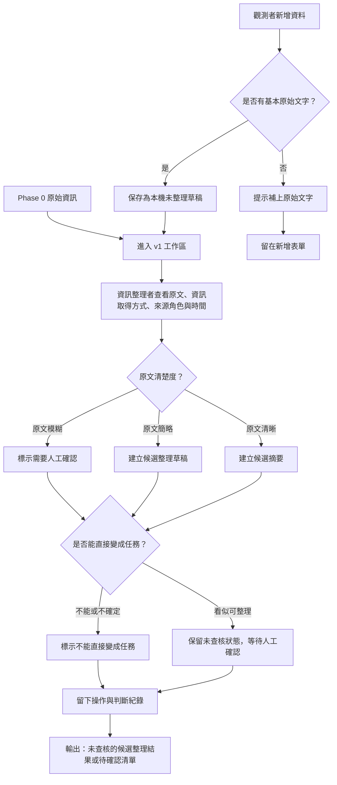

# 資訊流程設計

> Codex 草稿，待人類用 VS Code 預覽 Mermaid，並檢查流程是否合理。這份文件是 Release 02 流程設計，不是實作完成紀錄。

## 我的 v1 目標

- 我優先服務的使用者：資訊整理者。
- 這個使用者最想完成的事：在同一個工作台看懂 Phase 0 原始資訊，以及觀測者在本機新增的未整理草稿，判斷哪些需要人工確認、哪些不能直接變成任務。
- 我最想避免的錯誤：把本機新增資料、AI 草稿或整理結果顯示成 verified / confirmed，或讓行動者誤以為可以直接採取行動。

## 這次流程新增的範圍

- 觀測者可以新增一筆「本機未整理資料」。
- 本機新增資料只存在使用者自己的瀏覽器，不寫入 `src/fixtures/**`，不進 shared fixtures，也不上傳後端。
- 本機新增資料預設是 `unverified` / `needs_review`，不能直接成為整理後資料或任務。
- 本地持久化只用來保留課堂操作草稿，不代表正式資料來源，也不代表資料已查核。

## 自然語言流程描述

```text
v1 工作台一開始讀取 Phase 0 原始資訊，並另外讀取瀏覽器本機保存的觀測者新增草稿。

觀測者新增資料時，先輸入原始文字、資訊取得方式、來源角色、觀測或聽聞時間，以及自己不確定的地方。系統不要求觀測者填候選類型、原文清楚度或下一步，避免觀測者被迫做資訊整理者的判斷。

送出時，系統只檢查是否有基本原始文字；如果有，資料保存為本機未整理草稿，狀態固定為需要人工確認。

資訊整理者查看資料時，先比較原文、資訊取得方式、來源角色與時間。整理者判斷原文清楚度：原文模糊、原文簡略、原文清晰。這個判斷只描述原文是否支撐整理判斷，不代表資料已查核。

如果資料來源角色不明、內容模糊、時間不清楚，或會讓行動者誤解，資料標示為需要人工確認，且不能直接變成任務。

如果資料可以形成候選摘要，也只能建立候選整理草稿，仍然保留 unverified / needs_review。任何整理確認都只是工作台流程狀態，不是事實查核完成。

每次新增、修改、刪除、重設、確認整理、標示不能直接行動，都要留下操作或判斷紀錄。AI 可以協助產生摘要草稿，但不能決定資料是否為真、是否可行動、是否應派工。
```

## Mermaid 流程圖

請用 VS Code 預覽，確認流程圖能正常顯示。



## 本地持久化設計

- 儲存位置：瀏覽器本機儲存，例如 `localStorage`。
- 儲存目的：保留本機操作草稿，讓重新整理頁面後仍看得到觀測者新增資料與整理草稿。
- 不儲存內容：API key 或 secrets。
- 建議資料欄位：
  - `localId`：本機產生的臨時 ID。
  - `schemaVersion`：本機資料格式版本。
  - `rawText`：觀測者輸入的原始文字。
  - `sourceType`：資訊取得方式；它不是可信度。
  - `actorRelation`：當事人、現場志工、第三方轉述或角色待確認。
  - `observedAt`：觀測者填寫的觀測或聽聞時間，可空白。
  - `createdAt` / `updatedAt`：本機操作時間。
  - `verificationStatus`：固定為 `unverified` 或等價的未查核狀態。
  - `reviewState`：固定從 `needs_review` 開始。
  - `humanReviewNote`：人工確認註記。
  - `auditTrail`：新增、修改、刪除、重設、整理確認等操作紀錄。
- 清除機制：v1 應提供清除本機草稿或重設本機資料的操作，避免使用者以為資料已被正式保存。
- 邊界：本機資料不得自動合併到 `src/fixtures/shared/`，也不得覆蓋 Phase 0 原始資訊。

## 人工確認點

- 來源角色是否為當事人、現場志工、第三方轉述或角色待確認。
- 原文清楚度是原文模糊、原文簡略或原文清晰。
- 一筆資料是否只能留下待確認清單，不能形成候選整理草稿。
- 一筆候選整理結果是否會誤導行動者直接採取行動。

## 不能自動處理的分支

- AI 不能判斷資訊已查核或 verified。
- AI 不能判斷是否可以派人、送物資、前往現場或安排優先順序。
- AI 不能補真實地址、電話、人物身分、現場安全狀態或外部最新資訊。
- 系統不能把觀測者新增資料自動放進整理後資料，也不能因為存在本機儲存就顯示為已確認。

## 操作或判斷紀錄

- 觀測者新增資料：記錄建立時間、來源角色、資訊取得方式與觀測者自填的不確定處。
- 本機資料修改：記錄修改時間與修改欄位。
- 整理者判斷原文清楚度：記錄判斷值與理由。
- 標示需要人工確認：記錄需要確認什麼、為什麼現在不能確認。
- 標示不能直接變成任務：記錄阻礙原因。
- 清除本機資料：記錄使用者執行清除，但不保留已清除內容。

## 我檢查後修正了什麼

- 原本：觀測者新增資料可能直接和 Phase 0 原始資訊一起進入整理流程，容易讓人誤以為它也是課程提供的原始資料。
- 修正後：流程把觀測者新增資料標成「本機未整理草稿」，並要求與 Phase 0 fixture 分開保存與呈現。
- 為什麼：這樣可以符合不新增 v1 fixture、不污染 shared fixtures、不把本機輸入假裝成正式資料的限制。

## 我仍不確定的流程點

- 「觀測者」是否要沿用這個名稱，或改成更接近 persona 的「回報者」。
- 本地持久化是否要保存整理草稿的完整 audit trail，或只保存最後一次狀態與簡短理由。
- `localStorage` 容量、清除提示與資料遺失提醒要做到多明顯。
- 「原文清楚度」是否只顯示給資訊整理者，或也要讓行動者看到但搭配更強警示。
